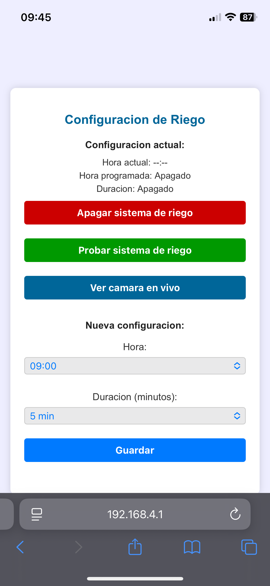

# 💧 M5CoreS3 Automatic Irrigation – Remote-Controlled Solar Watering System

An offline-friendly, touchscreen-controlled automatic irrigation system using the **M5Stack CoreS3** and a **solar-powered water pump**.

Web interface hosted on the device for easy configuration, plus optional **live camera stream** through an external Flask server.

---

## 🖼️ System Interfaces

<table>
  <tr>
    <td><strong>🌐 Web Interface</strong></td>
    <td><strong>📟 M5CoreS3 Screen</strong></td>
    <td><strong>🖥️ Flask Server Stream</strong></td>
  </tr>
  <tr>
    <td></td>
    <td></td>
    <td></td>
  </tr>
</table>

---

## 🔋 Features

- Set irrigation **start hour** (between 9:00–20:00)
- Select irrigation **duration** (5–60 min, in steps of 5)
- Manual "test irrigation" mode
- Real-time display of:
  - RTC module status
  - Relay status
  - Camera status
  - WiFi Access Point info
- Optional live camera stream with image upload to external server
- Remote server with simple browser-based viewer
- Offline capable – full config via Access Point mode

---

## 🔧 System Requirements

### Hardware
- M5Stack **CoreS3**
- I2C **Relay Unit**
- I2C **RTC (e.g. DS3231)**
- Optional: **ESP32 camera (OV3660)** connected via I2C
- 12V Solar-powered water pump system
- microSD card for future photo storage (optional)

### Software
- **UIFlow 2.2.5 (MicroPython)**
- Python 3.11+ on your remote server (Debian/Proxmox/etc.)

---

## 🧠 How It Works

1. CoreS3 acts as the main controller and Access Point (`RIEGO_M5`)
2. User connects via browser and configures irrigation schedule
3. Relay activates pump at specified time, using internal RTC
4. Optional: camera module uploads hourly snapshots to remote server
5. External Flask server receives and displays stream

---

## 🗂️ File Structure

```
m5CoreS3/
├── main.py              ← MicroPython code (UIFlow 2.0 compatible)
├── urequests.py         ← Required for HTTP requests (upload with Thonny)
└── config.json          ← Auto-created for storing hour/duration
flask_server/
└── server.py            ← Flask server code to receive and show stream
```

---

## 🚀 Installation Instructions

### 🔥 Install via M5Burner

If you prefer a simpler method, you can also install this project via **M5Burner**:

1. Open **M5Burner** on your computer.
2. Select the firmware **`m5CoreS3-automatic-irrigation`** from the list (or add it manually if not listed).
3. Connect your **M5Stack CoreS3** via USB.
4. Click **Burn** to install the firmware.
5. The device will reboot and launch the irrigation system automatically.


### 1. 📲 Upload to M5Stack CoreS3

- Use **Thonny** or **UIFlow Web IDE**
- Upload the following files to the **root** of the device:
  - `main.py`
  - `urequests.py`
- Restart the device.

> **Important:** `urequests.py` is required for HTTP communication with the external server.  
> Place it in the **root** (`/flash`) using Thonny.

---

### 2. 🖥️ Set Up the Flask Server

On your **Debian/Proxmox machine**:

```bash
sudo apt update
sudo apt install python3-venv
python3 -m venv servidorriego
source servidorriego/bin/activate
pip install flask
```

Create a file called `server.py` and paste the contents of `flask_server/server.py`

Then run:

```bash
python server.py
```

The server will start at:  
`http://<IP_LOCAL>:5000/stream` ← use this in your browser

---

## 🌐 Live Stream Integration

The stream is **triggered only when enabled** from the CoreS3 web interface.  
It will stop automatically when the user presses **"Stop stream"**, to avoid using data from a SIM card or consuming power.

---

## 📡 Wi-Fi Access Mode (Default)

When powered on, the M5CoreS3 becomes an access point with:

- **SSID:** `RIEGO_M5`
- **Password:** `Samuel123`

Access the UI via browser at `192.168.4.1`

---

## 📷 Stream Preview

The stream shows a new image every 2 seconds, uploaded from the CoreS3.

```html

```

You can customize this in `server.py`.

---

## 📄 License

MIT License – Free to use, adapt, and improve.

---

## 📬 Contact

For suggestions, ideas, or to collaborate:
💌 samuelcarre@mac.com  
