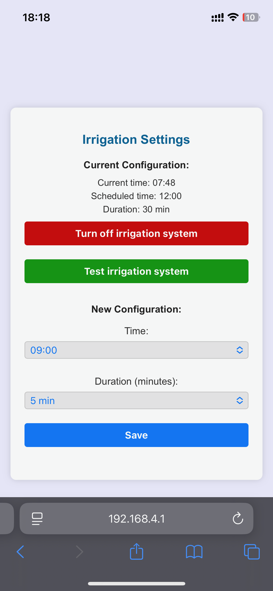

# 💧 M5CoreS3 Automatic Irrigation – Remote-Controlled Solar Watering System

An offline-friendly, touchscreen-controlled automatic irrigation system using the **M5Stack CoreS3** and a **solar-powered water pump**.

Web interface hosted on the device for easy configuration.

---

## 🖼️ System Interfaces

<table>
  <tr>
    <td><strong>🌐 Web Interface</strong></td>
    <td><strong>📟 M5CoreS3 Screen</strong></td>
    <td><strong>🔧 Installation </strong></td>
  </tr>
  <tr>
    <td></td>
    <td></td>
    <td></td>
  </tr>
</table>

---

## 🔋 Features

- Set irrigation **start hour** (between 9:00–20:00)
- Select irrigation **duration** (5–60 min, in steps of 5)
- Manual "test irrigation" mode
- Real-time display of:
  - RTC module status
  - Relay status
  - WiFi Access Point info
- Offline capable – full config via Access Point mode
- Reliable timekeeping using external **RTC HYM8563**
- Full MicroPython implementation using **UIFlow 2.2.5**

---

## 🔧 System Requirements

### Hardware
- M5Stack **CoreS3**
- I2C **Relay Unit** (connected via GPIO or Grove)
- I2C **RTC HYM8563** (address 0x51)
- 12V Solar-powered water pump system

### Software
- **UIFlow 2.2.5 (MicroPython)** on M5CoreS3

---

## 🧠 How It Works

1. CoreS3 acts as the main controller and Access Point (`RIEGO_M5`)
2. User connects via browser and configures irrigation schedule
3. Internal RTC (HYM8563) keeps time even when powered off
4. At scheduled time, the relay activates the pump
5. User can also run manual tests and disable irrigation via web UI

---

## 🗂️ File Structure

```
m5CoreS3/
├── main.py              ← Main MicroPython logic for CoreS3
├── config.json          ← Auto-created to store hour/duration configuration
```

---

## 🚀 Installation Instructions

### ✅ Option 1: Easy Install with **UIFlow 2.0**

1. Make sure your **M5Stack CoreS3** has **UIFlow 2.2.5** firmware installed (you can use **M5Burner** to flash it).
2. Go to [UIFlow 2.0 Web IDE](https://uiflow2.m5stack.com).
3. Connect your device (via USB or Wi-Fi).
4. Upload the file `main.py` to the device filesystem (`/flash`).
5. Restart the device – the irrigation system will launch automatically.


---

### 🔥 Option 2: Install with **M5Burner** (coming soon)

Soon you'll be able to install this project as a complete firmware directly from **M5Burner**:

- Just select `m5CoreS3-automatic-irrigation` from the list and click **"Burn"**.
- The system will boot and start automatically.

> 📌 This option will be available shortly.

---

## 📡 Wi-Fi Access Mode (Default)

When powered on, the M5CoreS3 becomes an access point:

- **SSID:** `RIEGO_M5`
- **Password:** `Samuel123`

Access the UI via browser at:

```
http://192.168.4.1
```

---

## ⏰ RTC Manual Time Sync (Optional)

To manually update RTC from REPL:

```python
from machine import Pin, I2C
RTC_I2C_ADDR = 0x51
i2c = I2C(1, scl=Pin(1), sda=Pin(2))

def dec2bcd(dec):
    return ((dec // 10) << 4) | (dec % 10)

new_time = bytes([
    dec2bcd(0),    # Seconds
    dec2bcd(59),   # Minutes
    dec2bcd(8),    # Hours
    dec2bcd(14),   # Day
    dec2bcd(1),    # Weekday
    dec2bcd(4),    # Month
    dec2bcd(25)    # Year (2025 → 25)
])
i2c.writeto_mem(RTC_I2C_ADDR, 0x02, new_time)
```

---

## 📄 License

MIT License – Free to use, adapt, and improve.

---

## 📬 Contact

For suggestions, ideas, or collaboration:
💌 samuelcarre@mac.com
